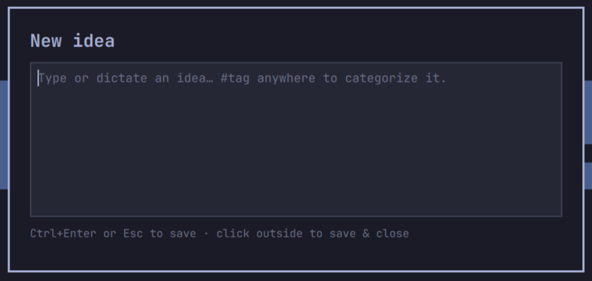
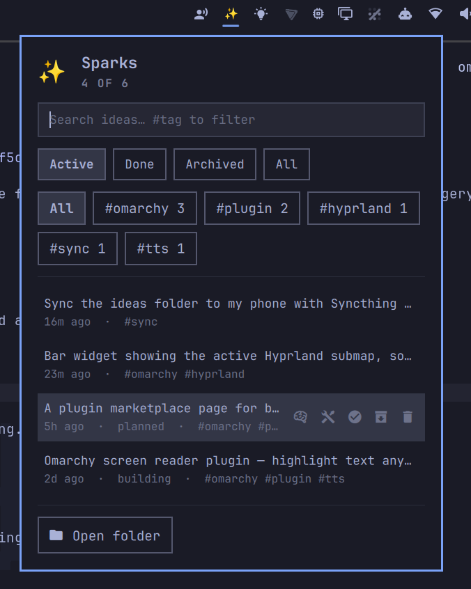

# Sparks

An [Omarchy](https://omarchy.org/) shell plugin for quick-capturing ideas. A
bar icon lists everything you've logged, searchable and filterable; a
keybinding pops a small floating window anywhere, any time, to type or dictate
a new one. When you're ready to think about one properly, one click hands it to
your coding agent to research into a planning brief — and another turns that
brief into a project.

Ideas are saved as plain Markdown files — nothing proprietary, no database —
so the folder is trivial to point a script, a sync tool, or an AI agent at.

| Capture window | Bar list |
|---|---|
|  |  |

## How it works

- **Bar icon** — click to see your ideas, newest first. The icon lights up
  while anything is still unreviewed. Type to search titles, tags and file
  contents; `#tag` in the search box filters by tag. Up/Down move, Enter opens,
  Esc clears the search and Esc again closes.
- **Row actions** — hover a row (or select it with the arrow keys) for
  󰧑 review, 󱁤 build, 󰗠 mark done, 󱉙 archive and 󰆴 delete.
- **Capture window** — trigger it with a keybinding (see [Install](#install)).
  Type or dictate, drop `#tags` anywhere in the text — Tab completes a tag
  you've used before — then either press `Ctrl+Enter`, press `Esc`, or click
  outside the window. All three save the idea if you typed anything; closing an
  empty window just closes it.

## Ideas as files

Each idea is one file in `~/Notes/ideas/` (configurable), named
`YYYY-MM-DD-HHMMSS-<slug-of-first-line>.md`. Your captured text is saved
verbatim under `## Idea`, followed by blank planning-brief headings to flesh
out later — the seed of a future planning task, not just a note to self:

```markdown
---
created: 2026-09-06T14:32:00+01:00
tags: sparks,ideas
status: new
---

## Idea
Add a plugin marketplace page. #sparks #ideas

## Context


## Goal


## Constraints


## Open questions


## Plan

```

Hashtags in the text are lifted into the `tags:` line on save and left in the
`## Idea` body too, so the file still reads naturally on its own — open it
directly, `grep` the folder, or hand the whole directory to an agent to plan
from.

The five headings are a starting point, not a fixed schema — edit the
`template_tail` heredoc in `bin/sparks`'s `new` case directly if you want
different sections. This is deliberately not a plugin setting: it's five
lines of bash, easier to change there than through a settings UI.

### Statuses

`status:` tracks where an idea has got to. It starts at `new` and the popup's
`Active | Done | Archived | All` filter defaults to hiding what's finished.

| Status | Means | Set by |
|---|---|---|
| `new` | Captured, not thought about yet | Capture |
| `planned` | Has a researched brief | The review handoff |
| `building` | Has a project underway | The build handoff |
| `done` | Finished | 󰗠 in the popup |
| `archived` | Not doing this | 󱉙 in the popup |

Archiving is non-destructive — the file stays exactly where it is, and 󰑐
restores it. Deleting is the only thing that removes a file, and it still asks
first.

## Handing an idea to your agent

An idea captured in ten seconds usually deserves more thought than it got.
Sparks ships two skills that give that thought to whichever coding agent you've
set as your Omarchy default.

**󰧑 Review** hands the idea to your agent with the `spark-review` skill: it
researches the idea against this machine and against your other ideas, then
fills in `## Context`, `## Goal`, `## Constraints`, `## Open questions` and
`## Plan` in the same file, and flips `status:` to `planned`. Your `## Idea`
text and its `created:` / `tags:` frontmatter are off limits to it.

**󱁤 Build** appears once an idea has a brief. It scaffolds `~/Work/<slug>/`
with a fresh git repo and a `BRIEF.md` symlinked back to the idea file, sets
`status: building` and `project:`, then hands the project to your agent with
the `spark-build` skill. Because `BRIEF.md` is a symlink, the plan stays in one
place — updates the agent makes while building show up in your idea list. After
that, the row's action becomes 󰝰 open the project.

Both run through `omarchy agent prompt`, so they respect
`omarchy default agent` and open in a terminal you can watch and steer, exactly
like `omarchy agent crash`. The prompt names the skill *and* gives its absolute
path, so an agent with no skill mechanism can just read the file.

The skills live in the plugin, at `agent/skills/spark-review/SKILL.md` and
`agent/skills/spark-build/SKILL.md`. Nothing is installed outside the plugin
directory, and `omarchy plugin remove` takes them with it. Edit them if you
want a different house style — that's the point of them being files.

## Requirements

- **Omarchy 4.x**, which ships the Quickshell-based `omarchy-shell`.
- **`jq`** — used by the backing script to build/parse JSON. Already a base
  Omarchy dependency (the same script pattern `omarchy-reminder` uses).
- **`xdg-open`** — opens an idea file or the ideas folder from the bar list.
- **A default coding agent**, for the review and build handoffs only —
  `omarchy default agent claude` (or opencode, codex, gemini…). Everything else
  works without one.

No network access, no elevated privileges. Dictation is Omarchy's own
`voxtype` — the mic button in the capture window just toggles it, and it's
hidden if voxtype isn't installed.

## Install

```bash
omarchy plugin add https://github.com/ollywarren/sparks.git --enable --yes
omarchy restart shell
```

Or by hand:

```bash
git clone https://github.com/ollywarren/sparks.git \
  ~/.config/omarchy/plugins/ollywarren.sparks
omarchy-shell shell rescanPlugins
omarchy plugin enable ollywarren.sparks right
```

Then bind a key to pop the capture window, in `~/.config/hypr/bindings.lua`:

```lua
o.bind("SUPER + ALT + N", "New idea", "omarchy-shell shell toggle ollywarren.sparks")
```

The capture window reads `ideasDir` from the same bar-widget settings the list
does, so changing the folder needs no change to the keybinding. You can still
override it per-invocation with a payload if you want a second capture key
writing somewhere else:

```lua
o.bind("SUPER + ALT + W", "Work idea",
  [[omarchy-shell shell toggle ollywarren.sparks '{"ideasDir":"~/Work/ideas"}']])
```

## Removal

```bash
omarchy plugin remove ollywarren.sparks
```

This asks for confirmation, takes the widget out of your bar, and deletes the
plugin directory. Your idea files in `~/Notes/ideas/` are deliberately left
behind — they're your notes, not plugin state. Delete them yourself if you
don't want them:

```bash
rm -rf ~/Notes/ideas
```

## IPC

```bash
omarchy-shell ollywarren.sparks toggle              # open / close the bar list
omarchy-shell shell toggle ollywarren.sparks '{}'   # open / close the capture window
```

The bar list and the capture window are two independent entry points of the
same plugin (`bar-widget` and `overlay` kinds), so each is toggled separately.

## What it writes

- `.md` files under your configured ideas folder (default `~/Notes/ideas/`),
  one per idea, only when you save one from the capture window. Row actions
  rewrite a single `status:` / `planned:` / `project:` line in one of them.
- A project directory under `projectsDir` (default `~/Work/`), but only when
  you press Build on an idea.
- Nothing else. No shell.json edits beyond what `omarchy plugin enable` /
  `disable` already does for the bar entry, no state file, no network calls.
  The processes it runs are `bash` (its own backing script, `bin/sparks`),
  `xdg-open`, `git init` on a new project, `voxtype` if you press the mic,
  `omarchy-agent-prompt` if you press review or build, and
  `omarchy-notification-send` to confirm a save — all of which ship with
  Omarchy or your desktop.

## Settings

Settings live inline on the bar layout entry in `~/.config/omarchy/shell.json`,
which hot-reloads on save:

```json
{ "id": "ollywarren.sparks", "ideasDir": "~/Documents/ideas", "maxListItems": 60 }
```

| Key | Default | What |
|---|---|---|
| `icon` | `✨` | Bar glyph |
| `ideasDir` | `~/Notes/ideas` | Folder ideas are saved to and listed from |
| `projectsDir` | `~/Work` | Where Build scaffolds a project |
| `panelWidth` | `380` | Popup width in px |
| `maxListItems` | `40` | Most ideas shown in the popup at once |

Or from the shell: `omarchy bar set ollywarren.sparks maxListItems 60`.

## Development

`bin/sparks` is a small, dependency-light bash script that owns all file I/O
and all process handoff, so the QML stays UI-only. Test it directly:

```bash
./bin/sparks list   ~/Notes/ideas
./bin/sparks new    ~/Notes/ideas "A test idea #testing"
./bin/sparks search ~/Notes/ideas piper
./bin/sparks tags   ~/Notes/ideas
./bin/sparks set    ~/Notes/ideas <file> status archived
./bin/sparks review ~/Notes/ideas <file>
./bin/sparks build  ~/Notes/ideas <file>
```

`set` only accepts `status`, `planned` and `project` — `created` and `tags` are
yours, written once at capture time. Every command that names a file refuses
anything outside the ideas directory.

Saving a file under `~/.config/omarchy/plugins/` normally hot-reloads it, but
the popup's contents can go stale — if a change to `Panel.qml` or `Capture.qml`
doesn't appear, `omarchy restart shell`. Check the manifest with `omarchy
plugin validate <dir>`, and watch for QML errors with `journalctl --user -f |
grep omarchy-shell`.

| File | What |
|---|---|
| `manifest.json` | Plugin declaration and settings schema |
| `Panel.qml` | Bar icon + idea list popup |
| `Capture.qml` | Floating quick-capture window |
| `bin/sparks` | File I/O and agent handoff |
| `agent/skills/spark-review/SKILL.md` | How an agent researches an idea into a brief |
| `agent/skills/spark-build/SKILL.md` | How an agent builds from a finished brief |

Typing in the popup filters, so the `h`/`j`/`k`/`l` and `x` shortcuts
`PanelKeyCatcher` normally offers are deliberately given up in favour of
letters reaching the search box. Arrows, Enter, Tab and Shift+Delete do the
same jobs.

## Licence

MIT — see [LICENSE](LICENSE).
