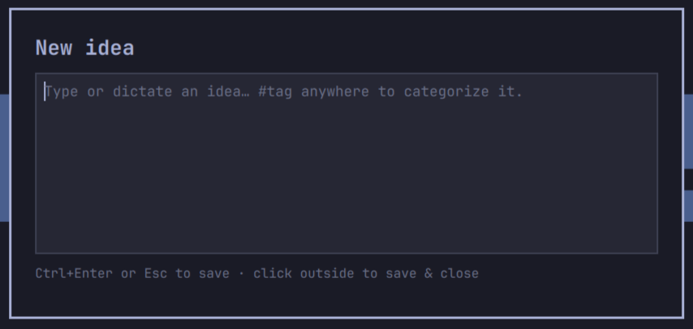
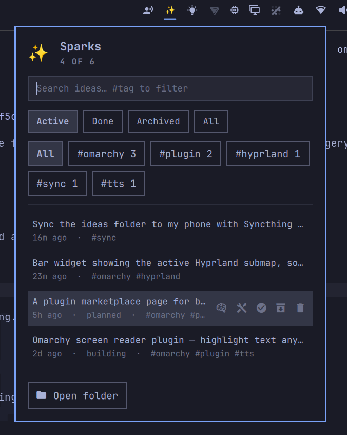

# Sparks

An [Omarchy](https://omarchy.org/) shell plugin for quick-capturing ideas. A
bar icon lists everything you've logged, searchable and filterable; a
keybinding pops a small floating window anywhere, any time, to type or dictate
a new one. When you're ready to think about one properly, and once you've
switched agent handoff on, it can go to your agent to research into a planning
brief — and then to go and make it.

An idea is whatever you throw in there: a short story, a photo book, a web app,
a desktop plugin, a hallway that needs repainting. Sparks doesn't care, and
neither do the skills it ships with. Some ideas you'll never hand to an agent —
a reminder is just a reminder — and nothing makes you.

Ideas are saved as plain Markdown files — nothing proprietary, no database —
so the folder is trivial to point a script, a sync tool, or an AI agent at.

| Capture window | Bar list |
|---|---|
|  |  |

## How it works

- **Bar icon** — click to see your ideas, newest first. The icon lights up
  while anything is still unreviewed. Type to search titles, tags and file
  contents; `#tag` in the search box filters by tag. Up/Down move, Enter opens,
  Esc clears the search and Esc again closes.
- **Row actions** — hover a row (or select it with the arrow keys) for
  󰗠 mark done, 󱉙 archive and 󰆴 delete, plus 󰧑 review and 󰐊 create once
  [agent handoff](#agent-handoff-is-opt-in) is on.
- **Settings** — 󰒓 in the popup header opens them: agent handoff on or off,
  the mode it runs in, and the ideas and workspace folders.
- **Capture window** — trigger it with a keybinding (see [Install](#install)).
  Type or dictate, drop `#tags` anywhere in the text — Tab completes a tag
  you've used before — then either press `Ctrl+Enter`, press `Esc`, or click
  outside the window. All three save the idea if you typed anything; closing an
  empty window just closes it.

## Ideas as files

Each idea is one file in `~/Notes/ideas/` (configurable), named
`YYYY-MM-DD-HHMMSS-<slug-of-first-line>.md`. Your captured text is saved
verbatim under `## Idea`, followed by blank planning-brief headings to flesh
out later — the seed of a future planning task, not just a note to self:

```markdown
---
created: 2026-09-06T14:32:00+01:00
tags: gift,photos
status: new
---

## Idea
A photo book of the garden through one year, as a present. #photos #gift

## Context


## Goal


## Constraints


## Open questions


## Plan

```

Hashtags in the text are lifted into the `tags:` line on save and left in the
`## Idea` body too, so the file still reads naturally on its own — open it
directly, `grep` the folder, or hand the whole directory to an agent to plan
from.

The five headings are a starting point, not a fixed schema — edit the
`template_tail` heredoc in `bin/sparks`'s `new` case directly if you want
different sections. This is deliberately not a plugin setting: it's five
lines of bash, easier to change there than through a settings UI.

### Statuses

`status:` tracks where an idea has got to. It starts at `new` and the popup's
`Active | Done | Archived | All` filter defaults to hiding what's finished.

| Status | Means | Set by |
|---|---|---|
| `new` | Captured, not thought about yet | Capture |
| `planned` | Has a researched brief | The review handoff |
| `creating` | Being made | The create handoff |
| `done` | Finished | 󰗠 in the popup |
| `archived` | Not doing this | 󱉙 in the popup |

Archiving is non-destructive — the file stays exactly where it is, and 󰑐
restores it. Deleting is the only thing that removes a file, and it still asks
first.

## Handing an idea to your agent

An idea captured in ten seconds usually deserves more thought than it got.
Sparks ships two skills that give that thought to whichever agent you've set as
your Omarchy default. Neither assumes the idea is software.

### Agent handoff is opt-in

A coding agent can act on your machine, so Sparks never starts one unless
you've said it may:

1. **Off by default.** Until you switch it on, Review and Create aren't in the
   popup, and Sparks is a plain capture, list, search and open tool. Switch it
   on under 󰒓 settings in the popup, or with
   `omarchy bar set ollywarren.sparks agentHandoff true --json`.
2. **Plan mode by default.** Omarchy's own agent launcher starts every agent
   with approvals switched off. Sparks launches the agent itself instead, in
   the mode you pick in settings:

   | Mode | What the agent does |
   |---|---|
   | **Plan** (default) | Read-only. It researches and proposes, and changes nothing until you approve. |
   | **Ask** | It prompts you before each action. |
   | **Auto** | Omarchy's auto-approve launch. It acts without asking. Choosing it asks you to confirm first. |

   Where an agent has no read-only mode (omp, hermes, muse), Plan starts it in
   Ask and tells you. Where it can't prompt at all (pi, openclaw, crush with a
   prompt), Plan and Ask refuse to launch rather than fall back to Auto. Ask
   uses the agent's own permission settings, so check them if you've relaxed
   them.
3. **A confirm on every click.** Review and Create each open a dialog naming
   the agent, the mode, and what will happen before anything runs.
   `bin/sparks` enforces it too, and won't hand off without `--confirmed`.

Review is read-only whatever the mode. The `spark-review` skill and its prompt
rule out installing packages, touching services or the compositor, editing
config, and git writes; sudo and pkexec are not used. Anything that can only be
checked by changing the machine goes into the brief as a step for you. Create
works freely inside its own workspace and asks before anything outside it.

### What the agent is given, and what leaves your machine

Sparks makes no network calls. The agent it launches is a separate program that
does: whatever you have set as `omarchy default agent` sends what it reads to
that vendor's model, and the skills allow it to search the web where an idea
leans on something outside your control. Switching agent handoff on is what
introduces that, which is why it starts off.

Every handoff opens a terminal you can watch and steer. Nothing runs in the
background, and nothing keeps running once you close it. What Sparks itself
puts in front of the agent is exactly this, and nothing else:

| Handed over | What it is |
|---|---|
| The idea file's absolute path | The agent reads the whole file, including the text you captured |
| Up to three related idea paths | Scored on shared tags and title words by `sparks related`, often none |
| The absolute path of the skill | `agent/skills/spark-review/` or `spark-create/`, both shipped in this plugin and readable |
| A working directory | Your ideas folder for Review, the new workspace for Create |

Being honest about the rest: an agent reads whatever your user account can, and
Review is started in your ideas folder with a skill that lets it read sibling
idea files. So the folder, not the one file, is the real scope of a review —
which is the reason Review defaults to a read-only mode, and the reason the
mode is shown on the button, in the confirm dialog and in settings. Sparks
passes it no credentials and no paths beyond the four above.

**󰧑 Review** hands the idea to your agent with the `spark-review` skill: it
researches the idea against this machine with read-only commands, fills in `## Context`, `## Goal`,
`## Constraints`, `## Open questions` and `## Plan` in the same file, and flips
`status:` to `planned`. Your `## Idea` text and its `created:` / `tags:`
frontmatter are off limits to it.

The prompt also names up to three ideas that overlap this one — scored on
shared tags and title words by `sparks related`, and frequently none at all.
That's deliberately a lookup rather than "go and read the folder": it catches
the idea you've captured twice, or the one this depends on, without the agent
manufacturing a connection out of a folder it was told to find one in, and
without getting slower as the folder fills up.

**󰐊 Create** appears once an idea has a brief. It scaffolds a workspace at
`~/Work/<slug>/` — a folder, a git repo and a `BRIEF.md` — sets
`status: creating` and `project:`, then hands it to your agent with the
`spark-create` skill. Afterwards the row's action becomes 󰝰 open the
workspace.

What comes out depends entirely on the brief. A web app produces code; a
hallway repaint produces a costed shortlist of colours and where to buy them.
The git repo is there so anything the agent does is undoable, not because
every idea is a software project.

`BRIEF.md` is not a copy of the brief — it is a symlink to the idea file
itself, so the workspace's spec and your note are one document. Nothing new is
ever added to your ideas folder. When the agent ticks off steps in `## Plan` as
it works, it is editing the note you open from the bar, so the plan stays
current rather than diverging from a snapshot taken at scaffold time. In the
popup the only visible change is the idea's timestamp refreshing and the row
moving to the top.

That holds only while the symlink does. If a tool replaces `BRIEF.md` instead
of editing it in place — some editors write a temp file and rename over the
original — the workspace gets its own private copy and your note silently
stops updating. The `spark-create` skill warns the agent off; `ls -l` in the
workspace is how you check.

Both use `omarchy default agent` and open in a terminal you can watch and
steer, with the same window class as `omarchy agent`. Auto goes through
`omarchy agent prompt` itself; Plan and Ask swap its auto-approve flag for the
agent's own plan or approval flag. The prompt names the skill *and* gives its
absolute path, so an agent with no skill mechanism can just read the file.

The skills live in the plugin, at `agent/skills/spark-review/SKILL.md` and
`agent/skills/spark-create/SKILL.md`. Nothing is installed outside the plugin
directory, and `omarchy plugin remove` takes them with it. Edit them if you
want a different house style — that's the point of them being files.

## Requirements

- **Omarchy 4.x**, which ships the Quickshell-based `omarchy-shell`.
- **`jq`** — used by the backing script to build/parse JSON. Already a base
  Omarchy dependency (the same script pattern `omarchy-reminder` uses).
- **`xdg-open`** — opens an idea file or the ideas folder from the bar list.
- **A default agent**, for the opt-in review and create handoffs only —
  `omarchy default agent claude` (or opencode, codex, gemini…). Everything else
  works without one.

Sparks makes no network calls of its own and needs no elevation:
sudo and pkexec are not used. The agent you can optionally hand an idea to is a
separate program with its own network access and its own privileges — see
[What the agent is given](#what-the-agent-is-given-and-what-leaves-your-machine).

Dictation is Omarchy's own `voxtype` — the mic button in the capture window
just toggles it, and it's hidden if voxtype isn't installed.

## Install

```bash
omarchy plugin add https://github.com/ollywarren/sparks.git --enable --yes
omarchy restart shell
```

That fetches the plugin into `~/.config/omarchy/plugins/ollywarren.sparks` and
puts the ✨ icon in your bar. To pick which section it lands in:

```bash
omarchy plugin enable ollywarren.sparks right
```

Then bind a key to pop the capture window, in `~/.config/hypr/bindings.lua`:

```lua
o.bind("SUPER + ALT + N", "New idea", "omarchy-shell shell toggle ollywarren.sparks")
```

The capture window reads `ideasDir` from the same bar-widget settings the list
does, so changing the folder needs no change to the keybinding. You can still
override it per-invocation with a payload if you want a second capture key
writing somewhere else:

```lua
o.bind("SUPER + ALT + W", "Work idea",
  [[omarchy-shell shell toggle ollywarren.sparks '{"ideasDir":"~/Work/ideas"}']])
```

## Removal

```bash
omarchy plugin remove ollywarren.sparks
```

This asks for confirmation, takes the widget out of your bar, and deletes the
plugin directory. Your idea files in `~/Notes/ideas/` are deliberately left
behind — they're your notes, not plugin state. Delete them yourself if you
don't want them:

```bash
rm -rf ~/Notes/ideas
```

## IPC

```bash
omarchy-shell ollywarren.sparks toggle              # open / close the bar list
omarchy-shell shell toggle ollywarren.sparks '{}'   # open / close the capture window
```

The bar list and the capture window are two independent entry points of the
same plugin (`bar-widget` and `overlay` kinds), so each is toggled separately.

## What it writes

- `.md` files under your configured ideas folder (default `~/Notes/ideas/`),
  one per idea, only when you save one from the capture window. Row actions
  rewrite a single `status:` / `planned:` / `project:` line in one of them.
- A workspace directory under `projectsDir` (default `~/Work/`), but only when
  agent handoff is on and you confirm Create on an idea.
- Its own settings on its bar entry in `~/.config/omarchy/shell.json`, through
  `omarchy bar set`, only when you change one in the 󰒓 settings view.
- Nothing else. No state file, no network calls.
  The processes it runs are `bash` (its own backing script, `bin/sparks`),
  `xdg-open`, `voxtype` if you press the mic, `omarchy-bar` when you change a
  setting, `omarchy-default-agent` to name your agent in the confirm dialog,
  and `omarchy-notification-send` to confirm a save. Only with handoff on and
  after you confirm: `git init` on a new workspace, and your agent through
  `omarchy-launch-tui` (Plan/Ask) or `omarchy-agent-prompt` (Auto). All of
  these ship with Omarchy or your desktop.

### Nothing is passed on a command line

What you type stays out of `argv`. An idea's text and a search query both go to
`bin/sparks` down a pipe, because a process's arguments are readable by every
other process on the machine — `ps` is enough — while its stdin is not. The
script refuses either as an argument, so no caller can put one back.

What does appear in a command line is a file path, because a path is what the
script is being asked to act on. Idea file names are built from the first line
of the note, so that line is legible in a path — as it already is to anything
that can list the folder.

### Nothing changes in the background

Sparks has no timer, no daemon and no migration step. Nothing is written when
the popup opens, when the capture window opens, when the shell restarts or when
you update the plugin. Opening the popup runs three read-only commands: list
the ideas folder, count the tags, and ask `omarchy-default-agent` for the name
to show you. Every write listed above is the direct result of something you
just did — saving a capture, clicking a row action, operating a control in the
󰒓 settings view, or confirming a handoff.

Your Omarchy config is only ever touched by that settings view. Each control
writes its own key through `omarchy bar set` the moment you operate it, one key
per change; Sparks never writes a default back, never migrates your entry, and
never touches any part of `shell.json` but its own bar entry. If you would
rather it never wrote there at all, don't use the settings view — every key can
be set by hand, and `omarchy plugin remove` takes the entry with it.

The one writer that is not your own hand is the agent, and only after you have
confirmed a handoff: Review fills in the five brief headings in that one idea
file and runs `sparks reviewed` to set `status:` and `planned:`. It is fenced in
by `bin/sparks` rather than by trust — `sparks set` accepts only `status`,
`planned` and `project`, your `## Idea` text and `created:` / `tags:` are never
writable, and every command that names a file refuses anything outside the
ideas folder. Switching agent handoff off stops all of it and takes the two
buttons out of the popup.

## Settings

The 󰒓 button in the popup header opens a settings view for agent handoff, its
mode and the two folders. Every setting lives inline on the bar layout entry
in `~/.config/omarchy/shell.json`, which hot-reloads on save:

```json
{ "id": "ollywarren.sparks", "ideasDir": "~/Documents/ideas", "maxListItems": 60 }
```

| Key | Default | What |
|---|---|---|
| `icon` | `✨` | Bar glyph |
| `ideasDir` | `~/Notes/ideas` | Folder ideas are saved to and listed from |
| `projectsDir` | `~/Work` | Where Create scaffolds a workspace |
| `agentHandoff` | `false` | Show Review and Create, and let them launch your agent after a confirm |
| `agentMode` | `plan` | `plan`, `ask` or `auto` — how the agent is launched |
| `panelWidth` | `380` | Popup width in px |
| `maxListItems` | `40` | Most ideas shown in the popup at once |

Or from the shell: `omarchy bar set ollywarren.sparks maxListItems 60`.

## Development

`bin/sparks` is a small, dependency-light bash script that owns all file I/O
and all process handoff, so the QML stays UI-only. Test it directly:

```bash
./bin/sparks list     ~/Notes/ideas
printf '%s' "A test idea #testing" | ./bin/sparks new ~/Notes/ideas
printf '%s' piper | ./bin/sparks search ~/Notes/ideas
./bin/sparks tags     ~/Notes/ideas
./bin/sparks related  ~/Notes/ideas <file>   # overlapping ideas, or []
./bin/sparks set      ~/Notes/ideas <file> status archived
./bin/sparks reviewed ~/Notes/ideas <file>   # status: planned + planned: today
./bin/sparks review   ~/Notes/ideas <file> --confirmed --mode plan
./bin/sparks create   ~/Notes/ideas <file> ~/Work --confirmed --mode plan
SPARKS_DRY_RUN=1 ./bin/sparks review ~/Notes/ideas <file> --confirmed --mode ask
```

`review` and `create` refuse to run without `--confirmed`. `--mode` defaults to
`plan`. `SPARKS_DRY_RUN=1` prints the agent command line instead of opening it.

`new` and `search` read what you typed from stdin and refuse it as an argument,
so neither an idea nor a search term is ever visible in the process table. Run
either with no input on a terminal and it waits for you to type and press
Ctrl-D.

`set` only accepts `status`, `planned` and `project` — `created` and `tags` are
yours, written once at capture time. Every command that names a file refuses
anything outside the ideas directory.

Saving a file under `~/.config/omarchy/plugins/` normally hot-reloads it, but
the popup's contents can go stale — if a change to `Panel.qml` or `Capture.qml`
doesn't appear, `omarchy restart shell`. Check the manifest with `omarchy
plugin validate <dir>`, and watch for QML errors with `journalctl --user -f |
grep omarchy-shell`.

| File | What |
|---|---|
| `manifest.json` | Plugin declaration and settings schema |
| `Panel.qml` | Bar icon + idea list popup and its settings view |
| `Capture.qml` | Floating quick-capture window |
| `bin/sparks` | File I/O and agent handoff |
| `agent/skills/spark-review/SKILL.md` | How an agent researches an idea into a brief |
| `agent/skills/spark-create/SKILL.md` | How an agent makes a finished brief real |

Typing in the popup filters, so the `h`/`j`/`k`/`l` and `x` shortcuts
`PanelKeyCatcher` normally offers are deliberately given up in favour of
letters reaching the search box. Arrows, Enter, Tab and Shift+Delete do the
same jobs.

## Licence

MIT — see [LICENSE](LICENSE).
